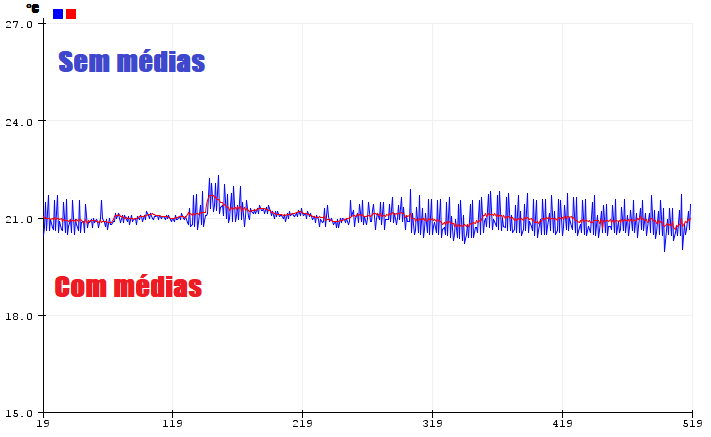
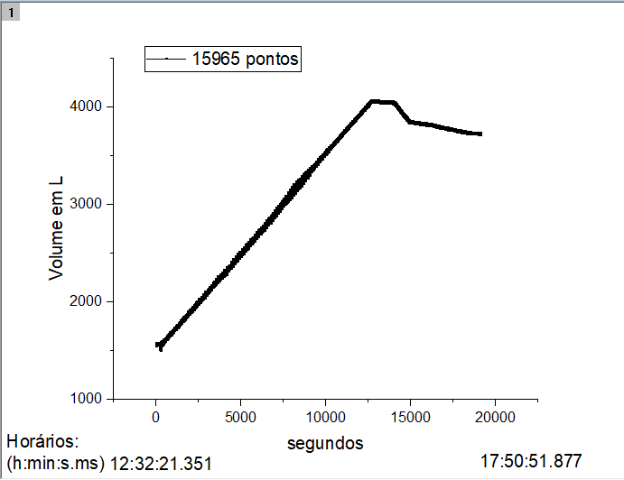

# Water ++
W ++ is a software and hardware system that allows you smartly to manage tank of liquids. In this context, my final project have three functionalities.

- Calculate, anytime, how much water contain in tank using statistics to determinate more precise possible.

- Calculate and manage how much water you spend day by day using graphics and getting control flux water.

- Identifies leakage and water loss caused by it.

# Why this project is important?

Because, mostly, we need solution for sustainable development, in this case, of water. We are in critical moment due COVID-19 and we must improve how to use water on 
day by day because of social isolation that makes us stay longer at home and spend more and more water. Moreover, propose by ONU, implementation of integrated water resources management by 2030 is goal 6:

>sustainable development goal 6.

In this goal, subitem 4:
>6.4 By 2030, substantially increase water-use efficiency across all sectors and ensure sustainable withdrawals and supply of freshwater to address water scarcity and substantially reduce the number of people suffering from water scarcity

Therefore, it is essential that we have tecnologies tools for improve more and more way how we use water day after day.

### Part 1: Hardware.
- First, we need make a littlle circuit, à la below: 

- Second, we need write a code wich to get and set information anytime, because we have two sensors, wich must be queried, and have one relay module that must to set.

- I use Arduino's IDE to code and hardware below:

- [x] Arduino uno.
- [x] Relay module.
- [x] 1 led blue.
- [x] 1 button.
- [x] 2 resistor (220 ohms).
- [x] LM35 (Temperature).
- [x] Jumpers.
- [x] Sensor ultrassonic HC-SR04.
- [x]  Protoboard.

### Part 2: Software.
- First, I wrote a code wich read the LM35 and to calculate local temperature. In this context, we need to use: "analogRead(A0);"
where "A0" is a pin which I use. Arduino have a registrador of 8 bits, then 1024 values of voltage

- Second, I wrote a code which read the HC-SR04 and to calculate distance until "object", in this case, water columm.
#### Step 1:
>Active trigger pin for emition pulse of sound.
#### Step 2:
>Active echo pin for get the return of the sound that was emitioned by trigger.
#### Step 3:
>The distance until object can be to calculate with this simple equation that depend of the sound velocity: distance = sound_velocity * time / 2 .

#### CODE

### Part 3: Experimental error.
- In this project I pretend that is so difficult meansure physical quantities like a temperature, distance and sound velocity in the air. Then, I use my recent newfound (Thanks CS50) to improve precision in each meansure. Let me go ahead and I show you some tricks that improve any measurements.

#### Avarege:
- We will analising temperature but it is can be make for any sample data. First, I use a pointer:
 >BYTE *mid = malloc(nt * sizeof(float));
 
 
and each chunks of memory I stored a sample data temperature:
mid[1] = T(1) ; mid[1] = T(1) ; ... ; mid[nt] = T(nt). See a code:

Now, I sum every floats in chunks and set avarege. See the result below where I compare two graphics without avarege and with avarege:  

#### Sound velocity:
- Now, I calculate sound velocity in the air using expression below:

Remember, the air is compose of 80% of N2 and 20% of O2. Then, M = 28.8 g/mol and gama = 7/5. Thus, we have: v = sqrt(T) * 20.086 (T in Kelvin).

#### Part 4: Graphics and data.
- I use the Arduino for make file tab separete values in the monitor serial of the computer and finally, I plotted this data. See the results! 

